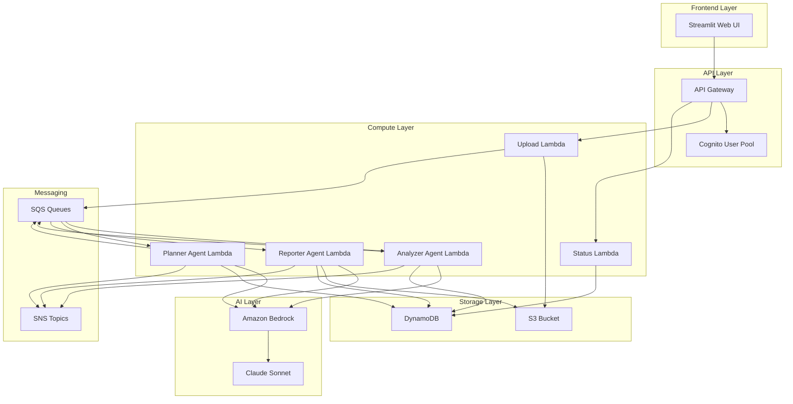

# EnergyGrid.AI Design Document

## Overview

EnergyGrid.AI is a serverless AI compliance copilot built on AWS that automates regulatory compliance management through intelligent document processing, obligation extraction, task planning, and report generation. The system uses a multi-agent architecture with specialized AI agents for different compliance workflows, backed by Amazon Bedrock and Claude Sonnet for natural language processing.

## Architecture

### High-Level Architecture



### Agent Architecture

The system implements a multi-agent pattern with three specialized agents:

1. **Analyzer Agent**: Extracts and categorizes compliance obligations from PDF documents
2. **Planner Agent**: Generates audit task plans based on extracted obligations
3. **Reporter Agent**: Compiles compliance reports from processed data

Each agent operates as an independent Lambda function with dedicated SQS queues for asynchronous processing.

## Components and Interfaces

### Frontend Components

#### Streamlit Web Application
- **Purpose**: Provides user interface for document upload, task management, and report viewing
- **Key Features**:
  - File upload with drag-and-drop support
  - Real-time processing status dashboard
  - Task management interface with filtering and sorting
  - Report generation and download
  - User authentication integration

#### Authentication Integration
- **Cognito Integration**: Seamless login/logout with session management
- **Role-Based Access**: Different permission levels for officers, managers, and administrators
- **Session Management**: Automatic token refresh and secure session handling

### API Layer Components

#### API Gateway Configuration
```yaml
Endpoints:
  - POST /documents/upload
  - GET /documents/{id}/status
  - GET /obligations
  - GET /tasks
  - POST /reports/generate
  - GET /reports/{id}
```

#### Lambda Functions

##### Upload Handler Lambda
- **Runtime**: Python 3.11
- **Memory**: 1024 MB
- **Timeout**: 5 minutes
- **Responsibilities**:
  - Validate PDF files (format, size, content)
  - Upload to S3 with metadata
  - Trigger processing pipeline via SQS
  - Return upload confirmation with document ID

##### Analyzer Agent Lambda
- **Runtime**: Python 3.11
- **Memory**: 3008 MB (for PDF processing)
- **Timeout**: 15 minutes
- **Responsibilities**:
  - Extract text from PDF using PyPDF2/pdfplumber
  - Call Bedrock Claude Sonnet for obligation extraction
  - Structure and categorize obligations
  - Store results in DynamoDB
  - Trigger next stage via SQS

##### Planner Agent Lambda
- **Runtime**: Python 3.11
- **Memory**: 1024 MB
- **Timeout**: 10 minutes
- **Responsibilities**:
  - Analyze obligations for audit requirements
  - Generate prioritized task lists using Claude Sonnet
  - Calculate timelines and resource assignments
  - Store tasks in DynamoDB
  - Trigger reporting pipeline

##### Reporter Agent Lambda
- **Runtime**: Python 3.11
- **Memory**: 2048 MB
- **Timeout**: 10 minutes
- **Responsibilities**:
  - Compile data from DynamoDB
  - Generate formatted reports using Claude Sonnet
  - Create PDF reports with charts and tables
  - Store reports in S3
  - Send completion notifications

##### Status Handler Lambda
- **Runtime**: Python 3.11
- **Memory**: 512 MB
- **Timeout**: 30 seconds
- **Responsibilities**:
  - Query processing status from DynamoDB
  - Return real-time progress updates
  - Handle status subscriptions for UI updates

### AI Integration Components

#### Amazon Bedrock Integration
- **Model**: Claude 3 Sonnet
- **Configuration**:
  - Max tokens: 4096
  - Temperature: 0.1 (for consistent extraction)
  - Top-p: 0.9
- **Usage Patterns**:
  - Structured prompts for obligation extraction
  - Few-shot learning for consistent categorization
  - Chain-of-thought reasoning for complex regulations

#### Prompt Engineering
```python
OBLIGATION_EXTRACTION_PROMPT = """
You are an expert regulatory compliance analyst. Extract all compliance obligations from the following regulatory text.

For each obligation, provide:
1. Obligation ID (unique identifier)
2. Description (clear, actionable statement)
3. Category (reporting, monitoring, operational, financial)
4. Severity (critical, high, medium, low)
5. Deadline type (recurring, one-time, ongoing)
6. Applicable entities (who must comply)

Text to analyze:
{document_text}

Return results in JSON format.
"""
```

## Data Models

### Document Model
```python
class Document:
    document_id: str          # Primary key
    filename: str
    upload_timestamp: datetime
    file_size: int
    s3_key: str
    processing_status: str    # uploaded, processing, completed, failed
    user_id: str
    metadata: dict
```

### Obligation Model
```python
class Obligation:
    obligation_id: str        # Primary key
    document_id: str          # Foreign key
    description: str
    category: str             # reporting, monitoring, operational, financial
    severity: str             # critical, high, medium, low
    deadline_type: str        # recurring, one-time, ongoing
    applicable_entities: list
    extracted_text: str
    confidence_score: float
    created_timestamp: datetime
```

### Task Model
```python
class Task:
    task_id: str             # Primary key
    obligation_id: str       # Foreign key
    title: str
    description: str
    priority: str            # high, medium, low
    assigned_to: str
    due_date: datetime
    status: str              # pending, in_progress, completed, overdue
    created_timestamp: datetime
    updated_timestamp: datetime
```

### Report Model
```python
class Report:
    report_id: str           # Primary key
    title: str
    report_type: str         # compliance_summary, audit_readiness, obligation_status
    date_range: dict         # start_date, end_date
    generated_by: str        # user_id
    s3_key: str             # PDF location
    status: str              # generating, completed, failed
    created_timestamp: datetime
```

### DynamoDB Table Design

#### Primary Tables
- **Documents**: Partition key: document_id
- **Obligations**: Partition key: obligation_id, GSI: document_id
- **Tasks**: Partition key: task_id, GSI: obligation_id, GSI: assigned_to
- **Reports**: Partition key: report_id, GSI: generated_by

#### Processing Status Table
- **ProcessingStatus**: Partition key: document_id, Sort key: stage
  - Tracks progress through: upload → analysis → planning → completion

## Error Handling

### Error Categories and Responses

#### Upload Errors
- **File Format Error**: Return 400 with supported formats
- **File Size Error**: Return 413 with size limits
- **S3 Upload Error**: Return 500 with retry guidance
- **Authentication Error**: Return 401 with login redirect

#### Processing Errors
- **PDF Extraction Error**: Retry with alternative libraries, fallback to OCR
- **Bedrock API Error**: Implement exponential backoff, circuit breaker pattern
- **DynamoDB Error**: Retry with jitter, implement dead letter queues
- **Timeout Error**: Split large documents, implement checkpointing

#### Error Recovery Strategies
```python
class ErrorHandler:
    def handle_bedrock_error(self, error):
        if error.code == 'ThrottlingException':
            return self.exponential_backoff_retry()
        elif error.code == 'ValidationException':
            return self.log_and_fail_gracefully()
        else:
            return self.send_to_dlq()
```

### Monitoring and Alerting
- **CloudWatch Metrics**: Track processing times, error rates, API latency
- **CloudWatch Alarms**: Alert on high error rates, processing delays
- **X-Ray Tracing**: End-to-end request tracing for debugging
- **SNS Notifications**: Real-time alerts for critical failures

## Testing Strategy

### Unit Testing
- **Lambda Functions**: Test each function in isolation with mocked dependencies
- **Agent Logic**: Test obligation extraction, task planning, and report generation
- **Data Models**: Validate serialization, validation, and business rules
- **Error Handling**: Test all error scenarios and recovery mechanisms

### Integration Testing
- **API Endpoints**: Test complete request/response cycles
- **AWS Service Integration**: Test S3, DynamoDB, Bedrock interactions
- **Agent Workflows**: Test end-to-end processing pipelines
- **Authentication Flow**: Test Cognito integration and session management

### End-to-End Testing
- **Document Processing**: Upload PDF → Extract obligations → Generate tasks → Create reports
- **User Workflows**: Complete user journeys through the Streamlit interface
- **Performance Testing**: Load testing with concurrent users and large documents
- **Security Testing**: Authentication, authorization, and data protection validation

### Test Data Management
- **Sample PDFs**: Curated set of regulatory documents for testing
- **Mock Responses**: Bedrock API responses for consistent testing
- **Test Users**: Cognito test users with different permission levels
- **Synthetic Data**: Generated obligations, tasks, and reports for testing

### Continuous Testing
- **GitHub Actions**: Automated testing on code changes
- **Staging Environment**: Full environment testing before production
- **Canary Deployments**: Gradual rollout with monitoring
- **Regression Testing**: Automated testing of existing functionality

## Security Considerations

### Data Protection
- **Encryption at Rest**: S3 and DynamoDB encryption with KMS
- **Encryption in Transit**: TLS 1.2+ for all API communications
- **Data Classification**: Sensitive regulatory data handling procedures
- **Data Retention**: Automated cleanup policies for temporary data

### Access Control
- **IAM Roles**: Least privilege access for Lambda functions
- **Cognito Groups**: Role-based access control for users
- **API Gateway**: Request validation and rate limiting
- **VPC Configuration**: Network isolation for sensitive operations

### Compliance
- **Audit Logging**: Comprehensive logging of all user actions
- **Data Residency**: Configurable AWS regions for data sovereignty
- **Backup and Recovery**: Automated backups with point-in-time recovery
- **Incident Response**: Procedures for security incidents and data breaches