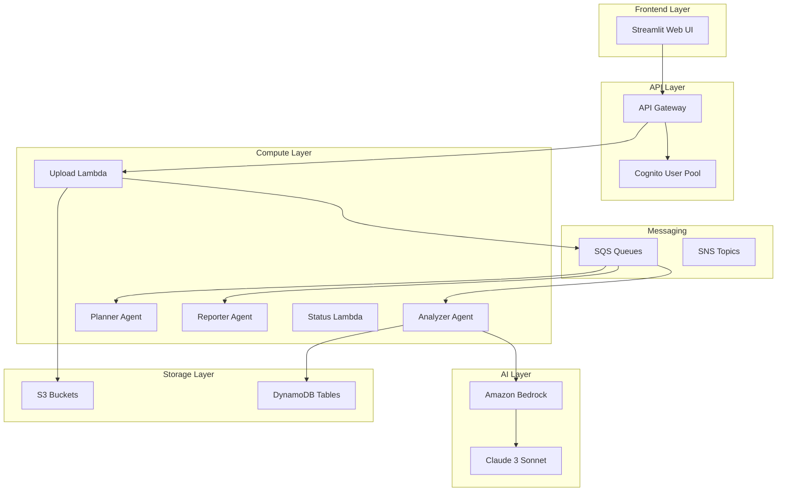

# EnergyGrid.AI Compliance Copilot

[](https://github.com/your-org/energygrid-ai-compliance-copilot/actions)
[](https://codecov.io/gh/your-org/energygrid-ai-compliance-copilot)
[](LICENSE)

An AI-powered compliance management system for energy sector organizations, built on AWS serverless architecture. EnergyGrid.AI automates regulatory compliance management through intelligent document processing, obligation extraction, task planning, and comprehensive report generation.

## 🚀 Features

- **Intelligent Document Processing**: Automatically extract compliance obligations from PDF regulations
- **AI-Powered Analysis**: Leverage Amazon Bedrock and Claude 3 Sonnet for natural language processing
- **Automated Task Planning**: Generate prioritized audit task lists with timelines
- **Comprehensive Reporting**: Create detailed compliance reports with charts and analytics
- **Real-time Monitoring**: Track processing status and receive notifications
- **Secure Authentication**: Role-based access control with AWS Cognito
- **Scalable Architecture**: Serverless design that scales automatically with demand

## 🏗️ Architecture



### Core Components

- **Frontend**: Streamlit web application with intuitive user interface
- **API Gateway**: RESTful API with Cognito authentication
- **Lambda Functions**: Serverless compute for all business logic
- **Amazon Bedrock**: AI service for natural language processing
- **Storage**: S3 for documents/reports, DynamoDB for structured data
- **Messaging**: SQS for async processing, SNS for notifications
- **Monitoring**: CloudWatch metrics, X-Ray tracing, custom alarms

## 📁 Project Structure

```
energygrid-ai-compliance-copilot/
├── .github/
│   └── workflows/           # CI/CD pipeline configurations
├── environments/            # Environment-specific configurations
│   ├── dev.json
│   ├── staging.json
│   └── prod.json
├── src/
│   ├── analyzer/           # Analyzer agent (obligation extraction)
│   │   ├── handler.py
│   │   ├── pdf_extractor.py
│   │   ├── bedrock_client.py
│   │   └── requirements.txt
│   ├── planner/            # Planner agent (task generation)
│   │   ├── handler.py
│   │   ├── task_planner.py
│   │   └── requirements.txt
│   ├── reporter/           # Reporter agent (report generation)
│   │   ├── handler.py
│   │   ├── report_generator.py
│   │   ├── pdf_generator.py
│   │   └── requirements.txt
│   ├── upload/             # Document upload handler
│   │   ├── handler.py
│   │   └── requirements.txt
│   ├── status/             # Status tracking handler
│   │   ├── handler.py
│   │   └── requirements.txt
│   ├── auth/               # Authentication and authorization
│   │   └── authorizer.py
│   ├── api/                # API endpoint handlers
│   │   ├── obligations_handler.py
│   │   ├── tasks_handler.py
│   │   └── reports_handler.py
│   ├── web/                # Streamlit web application
│   │   ├── app.py
│   │   ├── auth.py
│   │   └── pages/
│   ├── shared/             # Shared utilities and models
│   │   ├── models.py
│   │   ├── dynamodb_helper.py
│   │   ├── error_handler.py
│   │   └── config.py
│   └── monitoring/         # Monitoring and alerting
├── tests/                  # Test suites
│   ├── unit/
│   ├── integration/
│   ├── smoke_tests.py
│   └── performance/
├── template.yaml           # SAM CloudFormation template
├── samconfig.toml         # SAM configuration
├── deploy.sh              # Deployment automation script
├── Makefile               # Build and deployment commands
└── requirements.txt       # Python dependencies
```

## 🛠️ Prerequisites

### Required Software

- **AWS CLI** (v2.0+): [Installation Guide](https://docs.aws.amazon.com/cli/latest/userguide/getting-started-install.html)
- **SAM CLI** (v1.100+): [Installation Guide](https://docs.aws.amazon.com/serverless-application-model/latest/developerguide/install-sam-cli.html)
- **Python** (3.11+): [Download Python](https://www.python.org/downloads/)
- **Git**: [Installation Guide](https://git-scm.com/book/en/v2/Getting-Started-Installing-Git)

### AWS Requirements

- **AWS Account** with appropriate permissions
- **Amazon Bedrock Access** with Claude 3 Sonnet model enabled
- **IAM Permissions** for CloudFormation, Lambda, S3, DynamoDB, API Gateway, Cognito, SQS, SNS

### Required AWS Permissions

Your AWS user/role needs the following permissions:
- `CloudFormationFullAccess`
- `IAMFullAccess`
- `AWSLambda_FullAccess`
- `AmazonS3FullAccess`
- `AmazonDynamoDBFullAccess`
- `AmazonAPIGatewayAdministrator`
- `AmazonCognitoPowerUser`
- `AmazonSQSFullAccess`
- `AmazonSNSFullAccess`
- `CloudWatchFullAccess`
- `AWSXRayDaemonWriteAccess`
- `AmazonBedrockFullAccess`

## 🚀 Installation and Setup

### 1. Clone the Repository

```bash
git clone https://github.com/your-org/energygrid-ai-compliance-copilot.git
cd energygrid-ai-compliance-copilot
```

### 2. Configure AWS Credentials

```bash
# Configure AWS CLI with your credentials
aws configure

# Or use AWS profiles
aws configure --profile energygrid-dev
export AWS_PROFILE=energygrid-dev
```

### 3. Enable Amazon Bedrock Access

```bash
# Enable Claude 3 Sonnet model in your AWS region
aws bedrock put-model-invocation-logging-configuration \
    --region us-east-1 \
    --logging-config '{"cloudWatchConfig":{"logGroupName":"/aws/bedrock/modelinvocations","roleArn":"arn:aws:iam::ACCOUNT:role/service-role/AmazonBedrockExecutionRoleForCloudWatch"}}'
```

### 4. Install Dependencies

```bash
# Install Python dependencies
pip install -r requirements.txt

# Install development dependencies
make install
```

### 5. Deploy to Development Environment

```bash
# Quick deployment to dev environment
make deploy-dev

# Or use the deployment script with options
./deploy.sh -e dev -r us-east-1
```

### 6. Verify Deployment

```bash
# Run smoke tests to verify deployment
make smoke-test ENV=dev

# Check deployment status
make status ENV=dev

# View stack outputs
make outputs ENV=dev
```

## 🔧 Configuration

### Environment Variables

The system uses environment-specific configurations managed through SAM parameters:

| Parameter | Description | Default |
|-----------|-------------|---------|
| `Environment` | Deployment environment | `dev` |
| `CognitoDomainPrefix` | Cognito domain prefix | `energygrid-ai-compliance-{env}` |

### AWS Services Configuration

#### DynamoDB Tables
- **Documents**: Stores uploaded document metadata
- **Obligations**: Extracted compliance obligations
- **Tasks**: Generated audit tasks
- **Reports**: Generated compliance reports
- **ProcessingStatus**: Real-time processing status

#### S3 Buckets
- **Documents Bucket**: Stores uploaded PDF files
- **Reports Bucket**: Stores generated compliance reports

#### SQS Queues
- **Upload Queue**: Triggers document analysis
- **Analysis Queue**: Triggers task planning
- **Planning Queue**: Triggers report generation
- **Reporting Queue**: Handles report generation requests

## 📚 API Documentation

### Authentication

All API endpoints require authentication via AWS Cognito. Include the JWT token in the Authorization header:

```bash
Authorization: Bearer <jwt-token>
```

### Endpoints

#### Upload Document

```http
POST /documents/upload
Content-Type: multipart/form-data

{
  "file": <pdf-file>,
  "metadata": {
    "title": "Regulation Title",
    "source": "Regulatory Body",
    "effective_date": "2024-01-01"
  }
}
```

**Response:**
```json
{
  "document_id": "doc-123456",
  "status": "uploaded",
  "message": "Document uploaded successfully"
}
```

#### Get Processing Status

```http
GET /documents/{document_id}/status
```

**Response:**
```json
{
  "document_id": "doc-123456",
  "status": "processing",
  "stage": "analysis",
  "progress": 75,
  "estimated_completion": "2024-01-01T12:30:00Z"
}
```

#### List Obligations

```http
GET /obligations?category=reporting&severity=high&limit=50&offset=0
```

**Response:**
```json
{
  "obligations": [
    {
      "obligation_id": "obl-123456",
      "document_id": "doc-123456",
      "description": "Submit quarterly compliance report",
      "category": "reporting",
      "severity": "high",
      "deadline_type": "recurring",
      "confidence_score": 0.95
    }
  ],
  "total": 150,
  "limit": 50,
  "offset": 0
}
```

#### List Tasks

```http
GET /tasks?status=pending&priority=high&assigned_to=user123
```

**Response:**
```json
{
  "tasks": [
    {
      "task_id": "task-123456",
      "obligation_id": "obl-123456",
      "title": "Prepare Q1 Compliance Report",
      "description": "Compile data and prepare quarterly compliance report",
      "priority": "high",
      "status": "pending",
      "assigned_to": "user123",
      "due_date": "2024-04-15T00:00:00Z"
    }
  ],
  "total": 25,
  "limit": 50,
  "offset": 0
}
```

#### Generate Report

```http
POST /reports/generate
Content-Type: application/json

{
  "report_type": "compliance_summary",
  "date_range": {
    "start_date": "2024-01-01",
    "end_date": "2024-03-31"
  },
  "filters": {
    "categories": ["reporting", "monitoring"],
    "severities": ["high", "critical"]
  }
}
```

**Response:**
```json
{
  "report_id": "rpt-123456",
  "status": "generating",
  "estimated_completion": "2024-01-01T12:35:00Z"
}
```

#### Download Report

```http
GET /reports/{report_id}
```

**Response:**
- Content-Type: `application/pdf`
- Binary PDF content

### Error Responses

All endpoints return consistent error responses:

```json
{
  "error": {
    "code": "VALIDATION_ERROR",
    "message": "Invalid file format. Only PDF files are supported.",
    "details": {
      "field": "file",
      "received_type": "image/jpeg"
    }
  }
}
```

## 🧪 Development

### Local Development Setup

```bash
# Set up development environment
make dev-setup

# Install pre-commit hooks
pre-commit install

# Run local API for testing
make local-api
```

### Testing

```bash
# Run all tests
make test

# Run unit tests only
make test-unit

# Run integration tests
make test-integration

# Run with coverage
pytest tests/ --cov=src --cov-report=html
```

### Code Quality

```bash
# Format code
make format

# Run linting
make lint

# Run security scans
make security-scan

# Type checking
mypy src/
```

### Building and Deployment

```bash
# Validate SAM template
make validate

# Build application
make build

# Deploy to specific environment
make deploy ENV=staging

# Deploy with custom region
make deploy ENV=prod REGION=eu-west-1
```

## 🚀 Deployment

### Environment Management

The system supports three environments:

#### Development (dev)
- **Purpose**: Development and testing
- **Auto-scaling**: Minimal
- **Monitoring**: Basic
- **Data retention**: 7 days

#### Staging (staging)
- **Purpose**: Pre-production testing
- **Auto-scaling**: Moderate
- **Monitoring**: Enhanced
- **Data retention**: 30 days

#### Production (prod)
- **Purpose**: Live production system
- **Auto-scaling**: Full
- **Monitoring**: Comprehensive
- **Data retention**: 90 days
- **Backup**: Enabled
- **Deletion protection**: Enabled

### Deployment Commands

```bash
# Deploy to development
make deploy-dev

# Deploy to staging
make deploy-staging

# Deploy to production (requires confirmation)
make deploy-prod

# Deploy with guided setup
./deploy.sh -e dev --guided

# Deploy with specific AWS profile
./deploy.sh -e prod -p production-profile

# Validate template only
./deploy.sh --validate-only
```

### CI/CD Pipeline

The project includes GitHub Actions workflows for automated deployment:

- **Pull Request**: Runs tests and validation
- **Push to develop**: Deploys to staging
- **Push to main**: Deploys to production
- **Manual trigger**: Deploy to any environment

### Rollback

```bash
# Rollback deployment
make rollback ENV=staging

# Or use deployment script
./deploy.sh --rollback -e staging
```

## 📊 Monitoring and Observability

### CloudWatch Metrics

The system automatically tracks:
- **Lambda Performance**: Duration, errors, throttles
- **API Gateway**: Request count, latency, errors
- **DynamoDB**: Read/write capacity, throttles
- **SQS**: Message count, processing time
- **Custom Metrics**: Processing success rate, document types

### Alarms and Notifications

Configured alarms for:
- High error rates (>5 errors in 5 minutes)
- Long processing times (>14 minutes for analysis)
- Queue depth (>50 messages)
- Dead letter queue messages (>0 messages)

### Logging

```bash
# View logs for specific function
make logs ENV=dev

# View CloudWatch logs
aws logs tail /aws/lambda/dev-energygrid-analyzer --follow

# View X-Ray traces
aws xray get-trace-summaries --time-range-type TimeRangeByStartTime --start-time 2024-01-01T00:00:00 --end-time 2024-01-01T23:59:59
```

### Dashboards

Access CloudWatch dashboards for:
- System overview and health
- Performance metrics
- Error tracking and analysis
- Cost optimization insights

## 🔒 Security

### Data Protection

- **Encryption at Rest**: All S3 buckets and DynamoDB tables use AES-256 encryption
- **Encryption in Transit**: TLS 1.2+ for all API communications
- **Data Classification**: Sensitive regulatory data handling procedures
- **Data Retention**: Automated cleanup policies for temporary data

### Access Control

- **IAM Roles**: Least privilege access for all Lambda functions
- **Cognito Groups**: Role-based access control for users
  - `ComplianceOfficers`: Full access to documents, obligations, and tasks
  - `ComplianceManagers`: Full access plus report generation and user management
  - `Auditors`: Read-only access to reports and obligations
  - `Viewers`: Read-only access to basic compliance information
- **API Gateway**: Request validation and rate limiting
- **VPC Configuration**: Network isolation for sensitive operations

### Compliance

- **Audit Logging**: Comprehensive logging of all user actions
- **Data Residency**: Configurable AWS regions for data sovereignty
- **Backup and Recovery**: Automated backups with point-in-time recovery
- **Incident Response**: Procedures for security incidents and data breaches

## 🐛 Troubleshooting

### Common Issues

#### 1. Deployment Failures

**Issue**: CloudFormation stack creation fails
```bash
# Check stack events
make events ENV=dev

# View detailed error logs
aws cloudformation describe-stack-events --stack-name energygrid-compliance-copilot-dev
```

**Solutions**:
- Verify AWS permissions
- Check resource limits (Lambda concurrent executions, DynamoDB capacity)
- Ensure unique S3 bucket names
- Verify Bedrock model access

#### 2. Lambda Function Timeouts

**Issue**: Functions timing out during processing
```bash
# Check function logs
aws logs tail /aws/lambda/dev-energygrid-analyzer --follow
```

**Solutions**:
- Increase function timeout in template.yaml
- Optimize code for better performance
- Check external service dependencies (Bedrock API)
- Monitor memory usage and increase if needed

#### 3. Authentication Issues

**Issue**: Users cannot authenticate
```bash
# Check Cognito User Pool status
aws cognito-idp describe-user-pool --user-pool-id <pool-id>
```

**Solutions**:
- Verify user exists and is confirmed
- Check user group assignments
- Validate JWT token expiration
- Ensure Cognito domain is properly configured

#### 4. Document Processing Failures

**Issue**: Documents fail to process
```bash
# Check SQS dead letter queues
aws sqs get-queue-attributes --queue-url <dlq-url> --attribute-names All
```

**Solutions**:
- Verify PDF file format and size limits
- Check Bedrock API quotas and limits
- Monitor S3 bucket permissions
- Review error logs for specific failure reasons

#### 5. Performance Issues

**Issue**: Slow response times
```bash
# Check X-Ray traces
aws xray get-trace-summaries --time-range-type TimeRangeByStartTime --start-time <start> --end-time <end>
```

**Solutions**:
- Optimize Lambda function memory allocation
- Review DynamoDB read/write capacity
- Check API Gateway caching settings
- Monitor cold start times

### Debug Commands

```bash
# Check overall system health
make smoke-test ENV=dev

# View stack status
make status ENV=dev

# Get stack outputs
make outputs ENV=dev

# List all resources
make resources ENV=dev

# View recent events
make events ENV=dev

# Check function logs
aws logs tail /aws/lambda/dev-energygrid-upload --follow

# Monitor SQS queues
aws sqs get-queue-attributes --queue-url <queue-url> --attribute-names All

# Check DynamoDB table status
aws dynamodb describe-table --table-name dev-energygrid-documents
```

### Performance Optimization

#### Lambda Functions
- **Memory**: Start with 1024MB, adjust based on CloudWatch metrics
- **Timeout**: Set appropriate timeouts (5min for upload, 15min for analysis)
- **Concurrency**: Monitor and set reserved concurrency if needed

#### DynamoDB
- **Capacity**: Use on-demand billing for variable workloads
- **Indexes**: Optimize GSI usage for query patterns
- **Caching**: Consider DynamoDB Accelerator (DAX) for read-heavy workloads

#### S3
- **Storage Class**: Use Intelligent Tiering for cost optimization
- **Transfer Acceleration**: Enable for global users
- **Lifecycle Policies**: Automatically transition old data to cheaper storage

## 📈 Performance Benchmarks

### Expected Performance

| Operation | Expected Time | Throughput |
|-----------|---------------|------------|
| Document Upload | < 30 seconds | 100 docs/hour |
| Obligation Extraction | 2-5 minutes | 20 docs/hour |
| Task Generation | 1-2 minutes | 50 tasks/hour |
| Report Generation | 2-3 minutes | 10 reports/hour |

### Load Testing

```bash
# Run performance tests
python tests/performance/load_test.py

# Monitor during load test
watch -n 5 'aws cloudwatch get-metric-statistics --namespace AWS/Lambda --metric-name Duration --dimensions Name=FunctionName,Value=dev-energygrid-analyzer --start-time $(date -u -d "5 minutes ago" +%Y-%m-%dT%H:%M:%S) --end-time $(date -u +%Y-%m-%dT%H:%M:%S) --period 300 --statistics Average'
```

## 🤝 Contributing

We welcome contributions! Please follow these guidelines:

### Development Workflow

1. **Fork** the repository
2. **Create** a feature branch: `git checkout -b feature/amazing-feature`
3. **Make** your changes and add tests
4. **Run** tests and linting: `make ci-test`
5. **Commit** your changes: `git commit -m 'Add amazing feature'`
6. **Push** to the branch: `git push origin feature/amazing-feature`
7. **Open** a Pull Request

### Code Standards

- Follow PEP 8 style guidelines
- Add type hints to all functions
- Write comprehensive tests for new features
- Update documentation for API changes
- Use meaningful commit messages

### Testing Requirements

- Unit tests for all new functions
- Integration tests for API endpoints
- Smoke tests for deployment validation
- Performance tests for critical paths

## 📄 License

This project is licensed under the MIT License - see the [LICENSE](LICENSE) file for details.

## 🆘 Support

### Getting Help

- **Documentation**: Check this README and inline code documentation
- **Issues**: [GitHub Issues](https://github.com/your-org/energygrid-ai-compliance-copilot/issues)
- **Discussions**: [GitHub Discussions](https://github.com/your-org/energygrid-ai-compliance-copilot/discussions)
- **Email**: support@energygrid.ai

### Reporting Bugs

When reporting bugs, please include:
- Environment (dev/staging/prod)
- AWS region
- Error messages and logs
- Steps to reproduce
- Expected vs actual behavior

### Feature Requests

We welcome feature requests! Please provide:
- Use case description
- Expected behavior
- Business justification
- Implementation suggestions (optional)

## 🗺️ Roadmap

### Upcoming Features

- **Multi-language Support**: Support for documents in multiple languages
- **Advanced Analytics**: Machine learning insights and predictions
- **Integration APIs**: Connect with external compliance systems
- **Mobile App**: Native mobile application for task management
- **Workflow Automation**: Advanced workflow and approval processes

### Version History

- **v1.0.0**: Initial release with core functionality
- **v1.1.0**: Enhanced reporting and dashboard features
- **v1.2.0**: Performance optimizations and monitoring improvements
- **v2.0.0**: Multi-tenant architecture and advanced AI features (planned)

---

**Built with ❤️ by the EnergyGrid.AI Team**

