# EnergyGrid.AI Agent Workflow Visual

## Three-Agent Processing Pipeline

```mermaid
graph TB
    subgraph "Document Input"
        PDF[📄 PDF Regulatory Document]
        UPLOAD[📤 User Upload]
    end
    
    subgraph "Agent 1: Analyzer Agent 🤖"
        A1[🔍 PDF Text Extraction]
        A2[🧠 Claude 3 Sonnet Analysis]
        A3[📋 Obligation Extraction]
        A4[🏷️ Categorization & Scoring]
    end
    
    subgraph "Agent 2: Planner Agent 📋"
        P1[📊 Obligation Analysis]
        P2[🎯 Task Template Matching]
        P3[🤖 AI-Enhanced Planning]
        P4[⏰ Priority & Scheduling]
    end
    
    subgraph "Agent 3: Reporter Agent 📊"
        R1[📈 Data Compilation]
        R2[🧠 Claude Content Generation]
        R3[📄 PDF Report Creation]
        R4[☁️ S3 Storage]
    end
    
    subgraph "Data Storage"
        DDB[(🗄️ DynamoDB)]
        S3[(☁️ S3 Storage)]
    end
    
    subgraph "User Interface"
        UI[🖥️ Streamlit Dashboard]
        DASH[📊 Dashboard View]
        OBL[📋 Obligations View]
        TASKS[✅ Tasks View]
        REPORTS[📄 Reports View]
    end
    
    %% Flow connections
    PDF --> UPLOAD
    UPLOAD --> A1
    
    %% Analyzer Agent Flow
    A1 --> A2
    A2 --> A3
    A3 --> A4
    A4 --> DDB
    
    %% Planner Agent Flow
    DDB --> P1
    P1 --> P2
    P2 --> P3
    P3 --> P4
    P4 --> DDB
    
    %% Reporter Agent Flow
    DDB --> R1
    R1 --> R2
    R2 --> R3
    R3 --> R4
    R4 --> S3
    
    %% UI Connections
    DDB --> UI
    S3 --> UI
    UI --> DASH
    UI --> OBL
    UI --> TASKS
    UI --> REPORTS
    
    %% Styling
    classDef agent fill:#e1f5fe,stroke:#01579b,stroke-width:3px
    classDef storage fill:#f3e5f5,stroke:#4a148c,stroke-width:2px
    classDef ui fill:#e8f5e8,stroke:#1b5e20,stroke-width:2px
    
    class A1,A2,A3,A4,P1,P2,P3,P4,R1,R2,R3,R4 agent
    class DDB,S3 storage
    class UI,DASH,OBL,TASKS,REPORTS ui
```



## Detailed Agent Capabilities

### 🤖 Analyzer Agent (Claude 3 Sonnet Powered)

```mermaid
graph LR
    subgraph "Analyzer Agent Capabilities"
        INPUT[📄 PDF Document] --> EXTRACT[🔍 Text Extraction]
        EXTRACT --> AI[🧠 Claude 3 Sonnet]
        
        subgraph "AI Processing"
            AI --> CAT[🏷️ Categorization]
            AI --> SEV[⚠️ Severity Assessment]
            AI --> CONF[📊 Confidence Scoring]
            AI --> ENT[👥 Entity Identification]
        end
        
        CAT --> OUTPUT[📋 Structured Obligations]
        SEV --> OUTPUT
        CONF --> OUTPUT
        ENT --> OUTPUT
    end
    
    subgraph "Categories"
        REPORT[📊 Reporting]
        MONITOR[👁️ Monitoring]
        OPER[⚙️ Operational]
        FIN[💰 Financial]
    end
    
    subgraph "Severity Levels"
        CRIT[🔴 Critical]
        HIGH[🟠 High]
        MED[🟡 Medium]
        LOW[🟢 Low]
    end
    
    OUTPUT --> REPORT
    OUTPUT --> MONITOR
    OUTPUT --> OPER
    OUTPUT --> FIN
    
    OUTPUT --> CRIT
    OUTPUT --> HIGH
    OUTPUT --> MED
    OUTPUT --> LOW
```



### 📋 Planner Agent (Task Generation)

```mermaid
graph TB
    subgraph "Planner Agent Capabilities"
        OBL[📋 Obligations Input] --> TEMP[📝 Template Matching]
        TEMP --> BASE[🏗️ Base Task Generation]
        BASE --> AI_ENH[🤖 AI Enhancement]
        
        subgraph "Task Templates"
            T1[📊 Reporting Tasks]
            T2[👁️ Monitoring Tasks]
            T3[⚙️ Operational Tasks]
            T4[💰 Financial Tasks]
        end
        
        subgraph "AI Enhancement Features"
            DEP[🔗 Dependency Analysis]
            SEQ[📅 Sequencing]
            RES[👥 Resource Planning]
            RISK[⚠️ Risk Assessment]
        end
        
        TEMP --> T1
        TEMP --> T2
        TEMP --> T3
        TEMP --> T4
        
        AI_ENH --> DEP
        AI_ENH --> SEQ
        AI_ENH --> RES
        AI_ENH --> RISK
        
        DEP --> FINAL[✅ Prioritized Task List]
        SEQ --> FINAL
        RES --> FINAL
        RISK --> FINAL
    end
```



### 📊 Reporter Agent (Report Generation)

```mermaid
graph TB
    subgraph "Reporter Agent Capabilities"
        DATA[📊 Data Compilation] --> ANALYSIS[🔍 Analysis Engine]
        ANALYSIS --> AI_GEN[🤖 Claude Content Generation]
        AI_GEN --> FORMAT[📄 PDF Formatting]
        
        subgraph "Data Sources"
            D1[📋 Obligations Data]
            D2[✅ Tasks Data]
            D3[📄 Documents Data]
            D4[📈 Statistics]
        end
        
        subgraph "Report Types"
            R1[📊 Compliance Summary]
            R2[🔍 Audit Readiness]
            R3[📋 Obligation Status]
        end
        
        subgraph "Content Sections"
            S1[📝 Executive Summary]
            S2[📊 Data Overview]
            S3[⚠️ Risk Assessment]
            S4[💡 Recommendations]
        end
        
        DATA --> D1
        DATA --> D2
        DATA --> D3
        DATA --> D4
        
        AI_GEN --> R1
        AI_GEN --> R2
        AI_GEN --> R3
        
        AI_GEN --> S1
        AI_GEN --> S2
        AI_GEN --> S3
        AI_GEN --> S4
        
        FORMAT --> UPLOAD[☁️ S3 Upload]
    end
```



## Processing Flow Timeline

```mermaid
gantt
    title EnergyGrid.AI Processing Timeline
    dateFormat X
    axisFormat %s
    
    section Document Upload
    User uploads PDF    :0, 30s
    
    section Analyzer Agent
    PDF text extraction :30s, 60s
    Claude analysis     :60s, 180s
    Obligation storage  :180s, 200s
    
    section Planner Agent
    Template matching   :200s, 230s
    AI enhancement      :230s, 300s
    Task prioritization :300s, 320s
    
    section Reporter Agent
    Data compilation    :320s, 350s
    Content generation  :350s, 420s
    PDF creation        :420s, 450s
    
    section User Access
    Results available   :450s, 480s
```

## Agent Communication Pattern


## Key Agent Features

### 🎯 **Intelligent Processing Strands**

1. **Obligation Extraction Strand**
   - PDF text extraction with multiple fallback methods
   - Claude 3 Sonnet natural language processing
   - Confidence scoring and validation
   - Structured data output with categories and severity

2. **Task Planning Strand**
   - Template-based task generation
   - AI-enhanced planning with dependencies
   - Priority and resource optimization
   - Timeline and deadline management

3. **Report Generation Strand**
   - Multi-source data compilation
   - AI-powered content generation
   - Professional PDF formatting
   - Statistical analysis and insights

### 🔄 **Processing Resilience**
- Retry logic with exponential backoff
- Circuit breaker patterns for fault tolerance
- Dead letter queues for failed messages
- Comprehensive error handling and logging

### 📊 **Real-time Monitoring**
- Processing status tracking
- Performance metrics collection
- User notifications via SNS
- CloudWatch integration for observability

This three-agent system creates a comprehensive compliance management pipeline that transforms raw regulatory documents into actionable compliance programs with minimal human intervention!