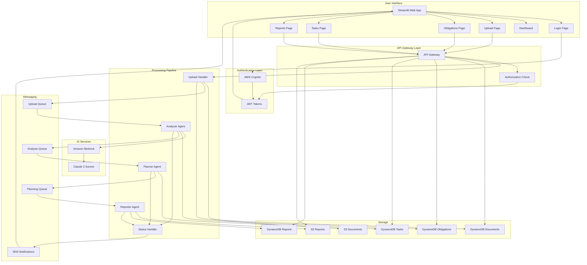
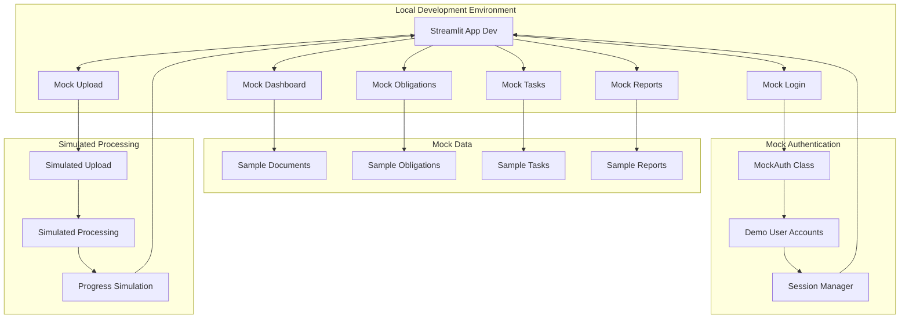
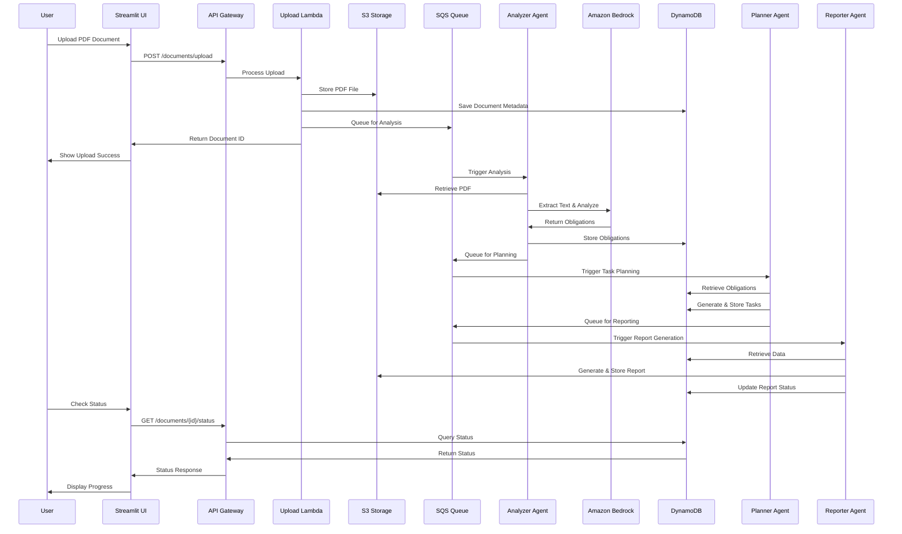
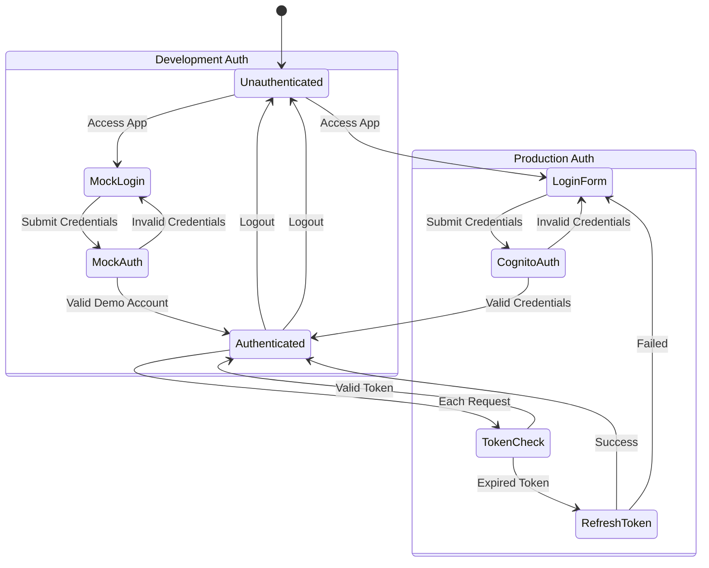
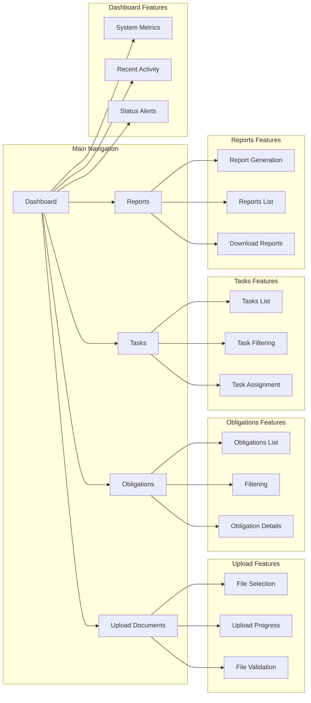
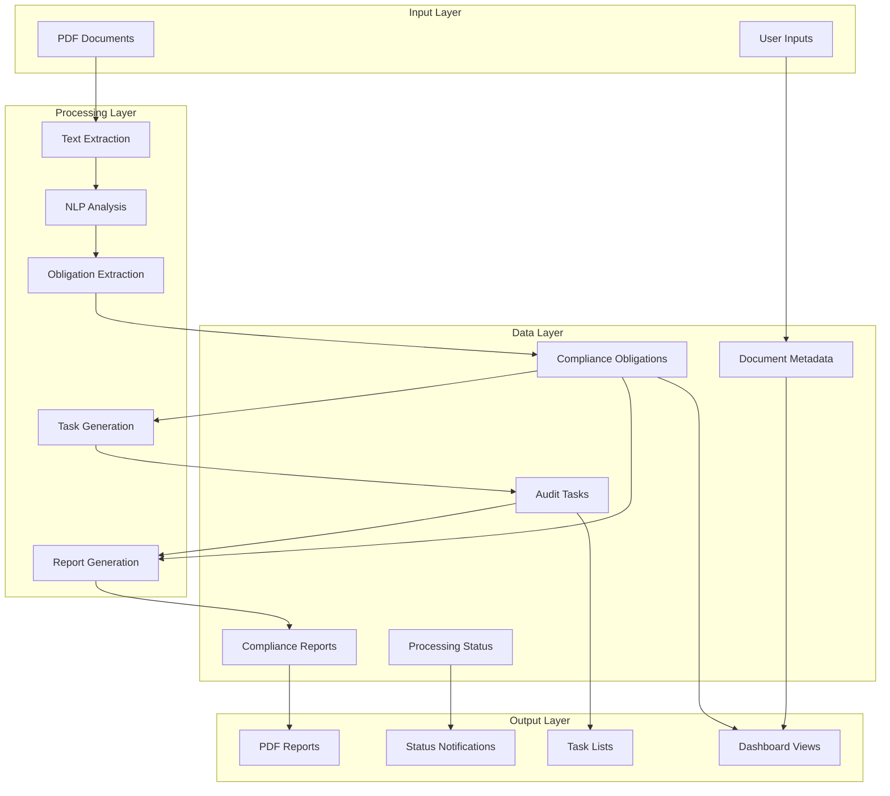

# EnergyGrid.AI Application Flow Diagrams

## Production Architecture Flow

## Development Mode Flow (Local)

## Document Processing Workflow

## User Authentication Flow

## Page Navigation Flow

## Data Flow Architecture

